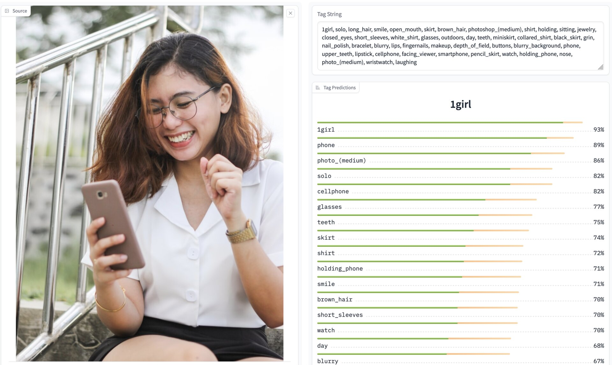
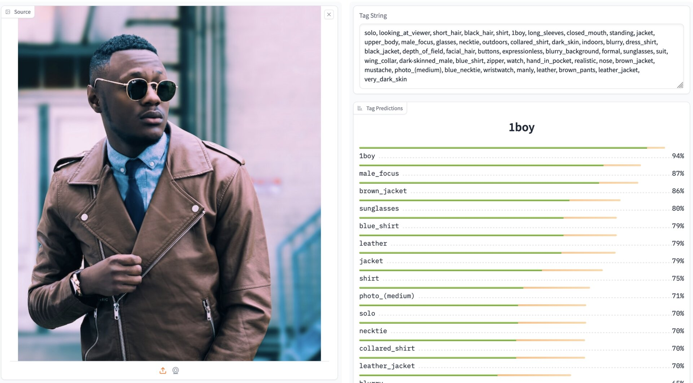

# JoyTag

JoyTag is a state of the art AI vision model for tagging images, with a focus on sex positivity and inclusivity. It uses the Danbooru tagging schema, but works across a wide range of images, from hand drawn to photographic.

## Quick Info

* Download: [HuggingFace](https://huggingface.co/fancyfeast/joytag/tree/main)
* Try it: [HuggingFace Spaces](https://huggingface.co/spaces/fancyfeast/joytag)
* Architecture: ViT-B/16
* Resolution: 448x448x3
* Parameters: 91.5M
* Output: Multi-Label Classification
* Tags: 5000+
* Training dataset: Danbooru 2021 + Auxiliary
* Training time: 660M samples
* F1 Score: 0.578 @ 0.4 threshold

## Examples




## What Does It Do?

Feed it an image, it spits out predictions for over 5000 different tags.  It is multi-label, so the predictions for each tag are independent of each other, unlike single class prediction vision models.  This enables automated "tagging" of images, which is useful for a wide range of applications including the training of Diffusion models on images lacking text pairs.


## Using the JoyTag Model

Download the model as specified above.  Example usage:

```python
from Models import VisionModel
from PIL import Image
import torch.amp.autocast_mode
from pathlib import Path
import torch
import torchvision.transforms.functional as TVF

model = VisionModel.load_model(path)
model.eval()

with open(Path(path) / 'top_tags.txt', 'r') as f:
	top_tags = [line.strip() for line in f.readlines() if line.strip()]

def prepare_image(image: Image.Image, target_size: int) -> torch.Tensor:
	# Pad image to square
	image_shape = image.size
	max_dim = max(image_shape)
	pad_left = (max_dim - image_shape[0]) // 2
	pad_top = (max_dim - image_shape[1]) // 2

	padded_image = Image.new('RGB', (max_dim, max_dim), (255, 255, 255))
	padded_image.paste(image, (pad_left, pad_top))

	# Resize image
	if max_dim != target_size:
		padded_image = padded_image.resize((target_size, target_size), Image.BICUBIC)
	
	# Convert to tensor
	image_tensor = TVF.pil_to_tensor(padded_image) / 255.0

	# Normalize
	image_tensor = TVF.normalize(image_tensor, mean=[0.48145466, 0.4578275, 0.40821073], std=[0.26862954, 0.26130258, 0.27577711])

	return image_tensor


@torch.no_grad()
def predict(image: Image.Image):
	image_tensor = prepare_image(image, model.image_size)
	batch = {
		'image': image_tensor.unsqueeze(0),
	}

	with torch.amp.autocast_mode.autocast('cpu', enabled=True):
		preds = model(batch)
		tag_preds = preds['tags'].sigmoid().cpu()
	
	scores = {top_tags[i]: tag_preds[0][i] for i in range(len(top_tags))}
	predicted_tags = [tag for tag, score in scores.items() if score > THRESHOLD]
	tag_string = ', '.join(predicted_tags)

	return tag_string, scores

image = Image.open('test.jpg')
tag_string, scores = predict(image)
```


## Goal

Most public vision models include heavy filtering of their training datasets.  This means that today's foundational vision models perform weakly at a fundemental level on a wide range of concepts.  This limits freedom of expression, inclusion, and diversity.  It also limits the fundmental understanding machine learning models have and will have of our world.  It is the belief of the JoyTag team that human users should be free to express themselves and not be discriminated against by arbitrary and capricious filtering of content.  The JoyTag team also believes that machine learning models should have a broad, deep, and inclusive understanding of the world.  This does not preclude the use of post-training alignment to reduce bias in models, but it does preclude the use of filtering or alignment which reduces the ability of a model to understand the world or the ability of users to express themselves.


## The JoyTag Model

The current JoyTag model is trained on a combination of the Danbooru 2021 dataset alongside a set of manually tagged images to expand the model's generalization beyond the danbooru domain.  The Danbooru dataset is used as the primary source of data because of its size (over 4 million human tagged images), its quality, and its diversity of tags.  The tagging system used by Danbooru is wide ranging and well defined.  However, the Danbooru dataset is limited in its diversity of content; it primarily focusses on anime/manga style art.  For example, only 0.3% of the dataset consists of photographic images.  To address this, the JoyTag team manually tagged a small number of images from the internet with a focus on photographs and other content not well represented in the primary dataset.

The latest model release achieves an F1 score of 0.578 across the entire dataset including photographs.  In manual testing on images not seen during training or validation, the model performs consistently, proving its ability to generalize well.

The JoyTag model is based on the ViT architecture with a CNN stem and GAP head.


## Training details

* Batch Size: 4096
* LAMB Optimizer
* Adam Beta: (0.9, 0.999)
* Adam Epsilon: 1e-6
* Weight Decay: 0.05
* TF32
* FP16 mixed precision
* Clip Gradient Norm: 1.0
* Trivial Augment
* Learning Rate: 0.004
* Cosine Decay
* No Warmup
* No mixup
* No label smoothing
* Focal loss with gamma=2.0
* Trained for 220M samples at a resolution of 224x224, followed by a restart for 440M samples at a resolution of 448x448.


## Development Notes

The model is primarily limited by data at this time, with overfitting occurring if pushed past the current training regimen or model size.  L/14@224 based models are able to train up to an F1 of 0.51 before overfitting.  Same for H/14 which only made a small F1 improvement and then overfit, even with increased StochDepth.  This is to be expected, as B/16@448 has similar computational costs as L/14@224, but less parameters, and thus seems to provide a way to expand the model while keeping good regularization.

Neither MixUp nor Label smoothing provided improvements in my testings at both 220M and 440M scales.  Mixup provided the most regularization, but the end F1 score was lower than without it.  The current learning rate, weight decay, and stochdepth rates appear to be close to optimal in the 220M range based on sweeps.  No experimentation was done on the settings for the 448 section of training, so its possible a more optimal learning rate is available there.

Trivial augment worked better than RandAugment and other augmentation schemes, providing the best cure against overfitting.  It's possible other augmentations could help regularize more and allow more training.

When overfitting, the model's F1 tends to continue to improve while the validation loss tanks.

Focal loss did not seem to make a significant difference during 220M sweeps, comparing to plain BCE loss.  Weighting by tag frequency did not improve results.

A loss multiplier was mandatory for stable training, likely due to quantity and extreme distribution of the tags compared to typical BCE tasks causing the loss to be too low for GradScaler to account for.  Simply multiplying the loss by 128 or 256 was sufficient to stabilize training.

AdamW works as well and can provide a very small improvement in F1, but LAMB results in a more stable training curve, and doesn't require tuning the warmup schedule.

Using a CNN stem instead of the traditional patching stem of ViTs provided a large boost to F1 on B/16 models.  It seemed to help less for L/14 models.  More investigation might be fruitful.


## Limitations

While an F1 score of 0.578 is good for a highly imbalanced multi-class task such as this, it is far from perfect.  The JoyTag model has a far better understanding of NSFW concepts than foundational models like the various CLIPs, but it fails on nuanced concepts that it just doesn't have enough data for like facial expressions (laughing, smiling, grinning, etc).

Some concepts are subjective, and thus the model tends to vasilate on them, like the size of breasts.  Danbooru has well specified guidelines for how these are to be tagged, but the dataset itself is not consistent with these guidelines.

A lack of additional data means that less common data, like various types of clothing and fashion, are handled weakly by the model today.  For example the tag "apron" is not well represented in the auxility dataset, and thus the model struggles with it.

Tags like "watermark" are still weak, in part because of a lack of good data, and in part because many watermarks are too small to be seen by the model even at 448x448 resolution.

The Danbooru tagging system is primarily geared for anime/manga style art, so while the JoyTag team believes that the system is robust enough to handle the needs of most photographic content, the original guidelines of its usage must be "translated" for photographic content and the needs of the model.  For example, the tag "nose" is only used by less than 0.5% of the danbooru dataset, because it is specified as being used only when the nose is "drawn" more "prominently" than normal.  How would this translate to photographic content?  The JoyTag team has made its best effort to translate the guidelines, but the imbalance and conflicting tagging rules make tags like this troublesome at this time.  For now, the JoyTag team has leaned towards tagging photographs based on the simple rule "is it visible?", which is believed to be more straightforward for the model, training, and downstream tasks.  The concept of "prominent" is better handled by tags ala "*_focus".

The JoyTag team's goal is for the model to handle a wide range of content with equal skill, and focussed on keeping the auxiliary dataset diverse to mitigate biases.  However, this is an on going battle that will always be a work in progress.  For example, the model still struggles with tags like "very dark skin".  If you find a tag that the model struggles with, please open an issue letting us know your experiences so we can better guide our efforts.


## Future Work

This is the initial release.  The JoyTag team is busy using the freshly trained model to assist in tagging more images to both expand the auxiliary dataset and improve the model's current weak points.


## Special Thanks

Special thanks go out to [SmilingWolf](https://github.com/SmilingWolf/SW-CV-ModelZoo/tree/main), for their work in pioneering vision models trained on the danbooru dataset.